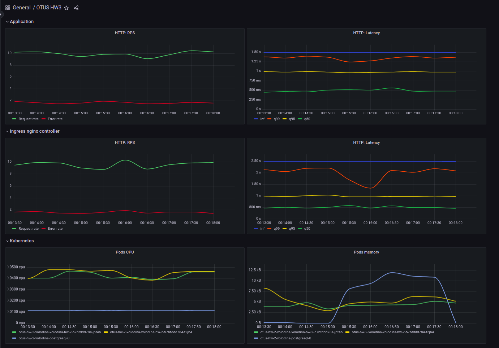

## Основы работы с Kubernetes

### Домашняя работа № 2 и № 3

### Используемый Docker образ
```shell
docker pull elenkavolodina/otus_hw2:v2
```

### Миграции
```shell
Команда alembic upgrade head вызывается в initContainers в hw_2_chart/templates/deployment.yaml
```

### Установка  Prometheus
```shell
helm repo add prometheus-community https://prometheus-community.github.io/helm-charts
helm repo update
kubectl create namespace prometheus-operator
helm upgrade --install -n otus-hw-2-volodina stack prometheus-community/kube-prometheus-stack -f prometheus/prometheus-operator-values.yaml
```
### Включение метрик nginx
```shell
helm upgrade --install nginx ingress-nginx/ingress-nginx --namespace m -f nginx-ingress.yaml
```

### Запуск приложения
```shell
kubectl create namespace otus-hw-2-volodina
helm upgrade --install -n otus-hw-2-volodina otus-hw-2-volodina ./hw_2_chart
```

### Удаление приложения
```shell
helm uninstall otus-hw-2-volodina -n otus-hw-2-volodina
```

### Postman коллекция
```shell
newman run postman_collection/otus_hw_2.postman_collection.json
```

### Созданный дашборд в Grafana



[grafana/dashboard.json](grafana/dashboard.json)
